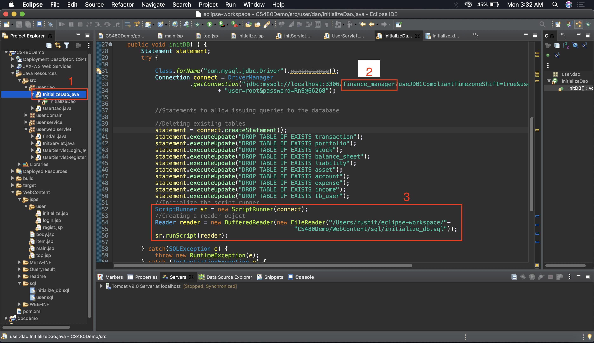

##Table of Contents

1. [Conceptual ER Diagram](#conceptual_er_diagram)
2. [Change History](#change_history)

# Conceptual ER Diagram

# Change History

##### Project Outline [07/12/2020]
This section describes the changes made to the CS480 Demo in order to adopt it to the chosen project. 
**Note**: 
- The steps to add the 'Initialize Database' button and to link it to the appropriate servlet were followed from the demo video provided. The changes described here are the ones made *after* following the steps from the demo. 
- The numberes in the list below correspond to the numbered changes (Red boxes) in the screenshots below.

###### Major Changes
1. Most changes in this version were made to `InitializeDao.java` file.
2. Changed database from `bookstore` to `finance_manager`. Database `finance_manager` was already created separately through the MySQL command line, so only other change in this part was to connect to this new `finanace_manager` database instead of the previously used `bookstore`database from the CS480 demo.
3. The tables for this new database are created and populated in the script `/src/WebContent/sql/initialize_db.sql`. The `ScriptRunner` object was used to run the script from within Java.
4. A dependency for the 'ScriptRunner' class was added to the project's `pom.xml` file.

**Other Minor Changes**
Some minor changes were required to be made to the conceptual ER diagram to obtain a better overall database design. These changes were as follows:
- Changed table name `bank_account` to just `account` since the the prior is inferred from the context in which the database has been created.
- The attribute `description` was removed from the table `account` (previously `bank_account`) since it was deemed unnecessary.
- A new `date_time` attribute has been added to the table `transaction` which defaults to the `CURRENT_TIMESTAMP` at which a transation is recorded in this table.
- The table name `user` was changed to `tb_user` to satisfy the given project requirements.

---

